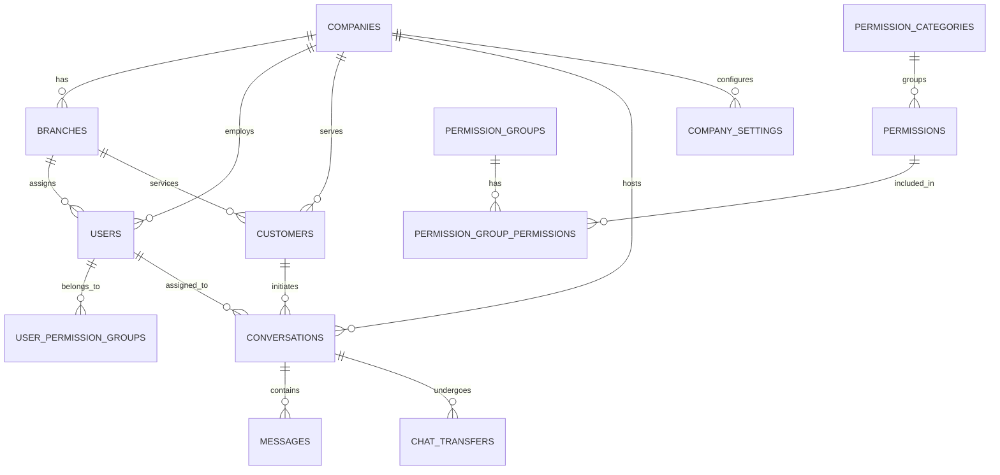

# Database Schema Design - Prime One

This document details the database schema design for **Prime One**, a SaaS multi-tenant ISP CMS platform built using **PostgreSQL** and **Drizzle ORM**. The schema is designed for multi-tenancy, with strict tenant isolation using `company_id` on all tenant-scoped tables.

---

## 1. PLATFORM & TENANCY TABLES

### `platform_owners`
Super administrators who own and manage the Prime One SaaS platform.

| Column Name | Data Type | Constraints | Description |
| :--- | :--- | :--- | :--- |
| `id` | UUID | PK | Unique identifier |
| `email` | VARCHAR(255) | UNIQUE, NOT NULL | Owner's email address |
| `name` | VARCHAR(255) | NOT NULL | Owner's full name |
| `password_hash` | VARCHAR(255) | NOT NULL | Bcrypt hashed password |
| `is_active` | BOOLEAN | DEFAULT true | Account status |
| `created_at` | TIMESTAMPTZ | DEFAULT NOW() | Record creation timestamp |
| `updated_at` | TIMESTAMPTZ | DEFAULT NOW() | Record update timestamp |

**Indexes:**
- `idx_platform_owners_email` on `email`

### `companies`
Represents the individual ISP companies (tenants) using the platform.

| Column Name | Data Type | Constraints | Description |
| :--- | :--- | :--- | :--- |
| `id` | UUID | PK | Unique identifier for the tenant |
| `name` | VARCHAR(255) | NOT NULL | Company name |
| `slug` | VARCHAR(255) | UNIQUE, NOT NULL | URL-friendly identifier |
| `logo_url` | VARCHAR(512) | NULL | URL to company logo |
| `favicon_url` | VARCHAR(512) | NULL | URL to company favicon |
| `primary_color` | VARCHAR(50) | NULL | Branding primary color (hex) |
| `secondary_color` | VARCHAR(50) | NULL | Branding secondary color (hex) |
| `address` | TEXT | NULL | Physical address |
| `phone` | VARCHAR(50) | NULL | Contact phone number |
| `email` | VARCHAR(255) | NULL | Contact email address |
| `website` | VARCHAR(255) | NULL | Company website URL |
| `api_key` | VARCHAR(255) | UNIQUE, NOT NULL | API key for integrations |
| `api_secret` | VARCHAR(255) | NOT NULL | API secret for secure auth |
| `subscription_plan` | VARCHAR(100) | NOT NULL | SaaS plan name |
| `max_users` | INTEGER | NOT NULL | Limit on staff users |
| `max_branches` | INTEGER | NOT NULL | Limit on branches |
| `is_active` | BOOLEAN | DEFAULT true | Tenant active status |
| `trial_ends_at` | TIMESTAMPTZ | NULL | Trial expiration date |
| `timezone` | VARCHAR(100) | DEFAULT 'UTC' | Company default timezone |
| `default_language` | VARCHAR(10) | DEFAULT 'en' | Default UI language |
| `working_hours_start` | TIME | NULL | Start of working day |
| `working_hours_end` | TIME | NULL | End of working day |
| `working_days` | INTEGER[] | NULL | Array of working days (0=Mon, 6=Sun) |
| `created_at` | TIMESTAMPTZ | DEFAULT NOW() | Creation timestamp |
| `updated_at` | TIMESTAMPTZ | DEFAULT NOW() | Update timestamp |
| `created_by` | UUID | FK -> `platform_owners(id)` | Creator reference |

**Indexes:**
- `idx_companies_slug` on `slug`
- `idx_companies_api_key` on `api_key`

### `branches`
Physical or logical branch locations for an ISP company.

| Column Name | Data Type | Constraints | Description |
| :--- | :--- | :--- | :--- |
| `id` | UUID | PK | Unique identifier |
| `company_id` | UUID | FK -> `companies(id)`, NOT NULL | Tenant association |
| `name` | VARCHAR(255) | NOT NULL | Branch name |
| `code` | VARCHAR(50) | NOT NULL | Branch internal code |
| `address` | TEXT | NULL | Physical address |
| `phone` | VARCHAR(50) | NULL | Branch contact number |
| `email` | VARCHAR(255) | NULL | Branch contact email |
| `latitude` | DECIMAL(10,8) | NULL | GPS latitude |
| `longitude` | DECIMAL(11,8) | NULL | GPS longitude |
| `is_active` | BOOLEAN | DEFAULT true | Status |
| `created_at` | TIMESTAMPTZ | DEFAULT NOW() | Creation timestamp |
| `updated_at` | TIMESTAMPTZ | DEFAULT NOW() | Update timestamp |

**Indexes:**
- `idx_branches_company_id` on `company_id`

---

## 2. USER & AUTH TABLES

### `users`
Company owners, staff members, helpdesk agents, and field engineers.

| Column Name | Data Type | Constraints | Description |
| :--- | :--- | :--- | :--- |
| `id` | UUID | PK | Unique identifier |
| `company_id` | UUID | FK -> `companies(id)`, NOT NULL | Tenant association |
| `branch_id` | UUID | FK -> `branches(id)`, NULL | Optional branch assignment |
| `email` | VARCHAR(255) | NOT NULL | Email address |
| `phone` | VARCHAR(50) | NULL | Contact number |
| `username` | VARCHAR(100) | NOT NULL | Login username |
| `password_hash` | VARCHAR(255) | NOT NULL | Bcrypt hashed password |
| `full_name` | VARCHAR(255) | NOT NULL | Full name |
| `display_name` | VARCHAR(100) | NULL | Preferred display name |
| `avatar_url` | VARCHAR(512) | NULL | Profile picture URL |
| `user_type` | ENUM | NOT NULL | 'company_owner' or 'staff' |
| `is_active` | BOOLEAN | DEFAULT true | Account status |
| `is_online` | BOOLEAN | DEFAULT false | Current presence status |
| `last_seen_at` | TIMESTAMPTZ | NULL | Last active timestamp |
| `last_login_at` | TIMESTAMPTZ | NULL | Last login timestamp |
| `language_preference` | ENUM | DEFAULT 'en' | 'en' or 'ur' |
| `fcm_token` | TEXT | NULL | Firebase Cloud Messaging token |
| `created_at` | TIMESTAMPTZ | DEFAULT NOW() | Creation timestamp |
| `updated_at` | TIMESTAMPTZ | DEFAULT NOW() | Update timestamp |

**Constraints:**
- UNIQUE (`company_id`, `email`)
- UNIQUE (`company_id`, `username`)

**Indexes:**
- `idx_users_company_id` on `company_id`
- `idx_users_email` on `email`
- `idx_users_is_online` on `is_online`

### `customers`
End customers of the ISP companies.

| Column Name | Data Type | Constraints | Description |
| :--- | :--- | :--- | :--- |
| `id` | UUID | PK | Unique identifier |
| `company_id` | UUID | FK -> `companies(id)`, NOT NULL | Tenant association |
| `branch_id` | UUID | FK -> `branches(id)`, NULL | Servicing branch |
| `customer_code` | VARCHAR(50) | NOT NULL | Auto-generated ID (Unique per company) |
| `full_name` | VARCHAR(255) | NOT NULL | Full legal name |
| `cnic` | VARCHAR(50) | NULL | National ID (if applicable) |
| `email` | VARCHAR(255) | NULL | Contact email |
| `phone` | VARCHAR(50) | NOT NULL | Primary phone number |
| `alt_phone` | VARCHAR(50) | NULL | Secondary phone number |
| `username` | VARCHAR(100) | NULL | PPPoE / Radius username |
| `address` | TEXT | NULL | Billing/Installation address |
| `area` | VARCHAR(255) | NULL | Neighborhood/Area |
| `city` | VARCHAR(100) | NULL | City |
| `latitude` | DECIMAL(10,8) | NULL | GPS latitude |
| `longitude` | DECIMAL(11,8) | NULL | GPS longitude |
| `customer_class` | ENUM | DEFAULT 'residential' | 'residential', 'business', 'corporate', 'government', 'vip' |
| `package_id` | UUID | NULL | Future FK to packages |
| `status` | ENUM | DEFAULT 'active' | 'active', 'inactive', 'suspended', 'disconnected' |
| `registration_date` | DATE | NULL | Date of registration |
| `activation_date` | DATE | NULL | Date of service activation |
| `notes` | TEXT | NULL | Internal remarks |
| `avatar_url` | VARCHAR(512) | NULL | Profile image URL |
| `language_preference` | VARCHAR(10) | DEFAULT 'en' | Preferred language |
| `fcm_token` | TEXT | NULL | Push notification token |
| `created_at` | TIMESTAMPTZ | DEFAULT NOW() | Creation timestamp |
| `updated_at` | TIMESTAMPTZ | DEFAULT NOW() | Update timestamp |

**Constraints:**
- UNIQUE (`company_id`, `customer_code`)

**Indexes:**
- `idx_customers_company_id` on `company_id`
- `idx_customers_phone` on `phone`
- `idx_customers_status` on `status`

### `email_otps`
Temporary OTPs for verification.

| Column Name | Data Type | Constraints | Description |
| :--- | :--- | :--- | :--- |
| `id` | UUID | PK | Unique identifier |
| `email` | VARCHAR(255) | NOT NULL | Target email |
| `otp_code` | VARCHAR(10) | NOT NULL | Generated code |
| `otp_type` | ENUM | NOT NULL | 'registration', 'login', 'password_reset' |
| `expires_at` | TIMESTAMPTZ | NOT NULL | Expiry time |
| `is_used` | BOOLEAN | DEFAULT false | Consumption flag |
| `created_at` | TIMESTAMPTZ | DEFAULT NOW() | Creation timestamp |

### `refresh_tokens`
Long-lived tokens for session management.

| Column Name | Data Type | Constraints | Description |
| :--- | :--- | :--- | :--- |
| `id` | UUID | PK | Unique identifier |
| `user_id` | UUID | FK -> `users(id)`, NULL | Staff reference |
| `customer_id` | UUID | FK -> `customers(id)`, NULL | Customer reference |
| `token_hash` | VARCHAR(255) | NOT NULL | Hashed token value |
| `device_info` | TEXT | NULL | User agent/device details |
| `expires_at` | TIMESTAMPTZ | NOT NULL | Expiry time |
| `is_revoked` | BOOLEAN | DEFAULT false | Revocation flag |
| `created_at` | TIMESTAMPTZ | DEFAULT NOW() | Creation timestamp |

---

## 3. RBAC / PERMISSIONS TABLES

### `permission_categories`
Groupings of permissions (e.g., 'Chat', 'Reports').

| Column Name | Data Type | Constraints | Description |
| :--- | :--- | :--- | :--- |
| `id` | UUID | PK | Unique identifier |
| `company_id` | UUID | FK -> `companies(id)`, NULL | NULL implies system-wide default |
| `name` | VARCHAR(100) | NOT NULL | Category name |
| `slug` | VARCHAR(100) | NOT NULL | Identifier slug |
| `description` | TEXT | NULL | Category description |
| `display_order` | INTEGER | DEFAULT 0 | UI sorting |
| `created_at` | TIMESTAMPTZ | DEFAULT NOW() | Creation timestamp |

### `permissions`
Individual granular permissions.

| Column Name | Data Type | Constraints | Description |
| :--- | :--- | :--- | :--- |
| `id` | UUID | PK | Unique identifier |
| `category_id` | UUID | FK -> `permission_categories(id)`, NOT NULL | Category reference |
| `name` | VARCHAR(100) | NOT NULL | Human-readable name |
| `slug` | VARCHAR(100) | UNIQUE, NOT NULL | E.g., 'chat.view' |
| `description` | TEXT | NULL | Details |
| `is_system` | BOOLEAN | DEFAULT true | If true, cannot be deleted |
| `created_at` | TIMESTAMPTZ | DEFAULT NOW() | Creation timestamp |

### `permission_groups`
Custom roles defined per company.

| Column Name | Data Type | Constraints | Description |
| :--- | :--- | :--- | :--- |
| `id` | UUID | PK | Unique identifier |
| `company_id` | UUID | FK -> `companies(id)`, NOT NULL | Tenant association |
| `name` | VARCHAR(100) | NOT NULL | Group name (e.g., 'Senior Helpdesk') |
| `description` | TEXT | NULL | Group description |
| `is_default` | BOOLEAN | DEFAULT false | Auto-assign to new users? |
| `created_at` | TIMESTAMPTZ | DEFAULT NOW() | Creation timestamp |
| `updated_at` | TIMESTAMPTZ | DEFAULT NOW() | Update timestamp |

### `permission_group_permissions`
Maps permissions to groups.

| Column Name | Data Type | Constraints | Description |
| :--- | :--- | :--- | :--- |
| `id` | UUID | PK | Unique identifier |
| `permission_group_id` | UUID | FK -> `permission_groups(id)`, NOT NULL | Group reference |
| `permission_id` | UUID | FK -> `permissions(id)`, NOT NULL | Permission reference |
| `granted` | BOOLEAN | DEFAULT true | Grant/Deny flag |
| `created_at` | TIMESTAMPTZ | DEFAULT NOW() | Creation timestamp |

### `user_permission_groups`
Maps users to permission groups.

| Column Name | Data Type | Constraints | Description |
| :--- | :--- | :--- | :--- |
| `id` | UUID | PK | Unique identifier |
| `user_id` | UUID | FK -> `users(id)`, NOT NULL | User reference |
| `permission_group_id` | UUID | FK -> `permission_groups(id)`, NOT NULL | Group reference |
| `assigned_by` | UUID | FK -> `users(id)`, NULL | Who assigned this group |
| `created_at` | TIMESTAMPTZ | DEFAULT NOW() | Creation timestamp |

### `user_permission_overrides`
Overrides specific permissions at the user level.

| Column Name | Data Type | Constraints | Description |
| :--- | :--- | :--- | :--- |
| `id` | UUID | PK | Unique identifier |
| `user_id` | UUID | FK -> `users(id)`, NOT NULL | User reference |
| `permission_id` | UUID | FK -> `permissions(id)`, NOT NULL | Permission reference |
| `granted` | BOOLEAN | NOT NULL | Grant/Deny flag |
| `assigned_by` | UUID | FK -> `users(id)`, NULL | Who set this override |
| `created_at` | TIMESTAMPTZ | DEFAULT NOW() | Creation timestamp |

---

## 4. CHAT & MESSAGING TABLES

### `conversations`
Support chat sessions.

| Column Name | Data Type | Constraints | Description |
| :--- | :--- | :--- | :--- |
| `id` | UUID | PK | Unique identifier |
| `company_id` | UUID | FK -> `companies(id)`, NOT NULL | Tenant association |
| `customer_id` | UUID | FK -> `customers(id)`, NOT NULL | Customer reference |
| `initiated_by` | ENUM | NOT NULL | 'customer' or 'staff' |
| `status` | ENUM | DEFAULT 'waiting' | 'waiting', 'active', 'on_hold', 'closed' |
| `assigned_to` | UUID | FK -> `users(id)`, NULL | Currently assigned staff |
| `assigned_at` | TIMESTAMPTZ | NULL | Assignment timestamp |
| `previous_assignee`| UUID | FK -> `users(id)`, NULL | Previously assigned staff |
| `priority` | ENUM | DEFAULT 'normal' | 'low', 'normal', 'high', 'urgent' |
| `subject` | VARCHAR(255) | NULL | Brief topic |
| `closure_reason` | VARCHAR(255) | NULL | Why it was closed |
| `closure_outcome` | TEXT | NULL | Result of conversation |
| `closed_by` | UUID | FK -> `users(id)`, NULL | User who closed it |
| `closed_at` | TIMESTAMPTZ | NULL | Closure timestamp |
| `customer_rating` | INTEGER | NULL | 1-5 stars |
| `customer_feedback`| TEXT | NULL | Additional feedback |
| `last_message_at` | TIMESTAMPTZ | NULL | Timestamp of last message |
| `last_customer_message_at`| TIMESTAMPTZ| NULL | Timestamp of last customer msg |
| `last_staff_message_at`| TIMESTAMPTZ| NULL | Timestamp of last staff msg |
| `unread_count_customer`| INTEGER | DEFAULT 0 | Unread count for customer |
| `unread_count_staff`| INTEGER | DEFAULT 0 | Unread count for staff |
| `metadata` | JSONB | DEFAULT '{}'::jsonb | Extensible data |
| `created_at` | TIMESTAMPTZ | DEFAULT NOW() | Creation timestamp |
| `updated_at` | TIMESTAMPTZ | DEFAULT NOW() | Update timestamp |

**Indexes:**
- `idx_conversations_company_id` on `company_id`
- `idx_conversations_customer_id` on `customer_id`
- `idx_conversations_status` on `status`
- `idx_conversations_assigned_to` on `assigned_to`

### `messages`
Individual messages within a conversation.

| Column Name | Data Type | Constraints | Description |
| :--- | :--- | :--- | :--- |
| `id` | UUID | PK | Unique identifier |
| `conversation_id` | UUID | FK -> `conversations(id)`, NOT NULL | Parent conversation |
| `company_id` | UUID | FK -> `companies(id)`, NOT NULL | Tenant association |
| `sender_type` | ENUM | NOT NULL | 'customer', 'staff', 'system' |
| `sender_customer_id`| UUID | FK -> `customers(id)`, NULL | If sender=customer |
| `sender_user_id` | UUID | FK -> `users(id)`, NULL | If sender=staff |
| `message_type` | ENUM | DEFAULT 'text' | 'text', 'image', 'voice', 'video', 'document', 'system' |
| `content` | TEXT | NULL | Text payload |
| `file_url` | VARCHAR(512) | NULL | Attachment URL |
| `file_name` | VARCHAR(255) | NULL | Original filename |
| `file_size` | INTEGER | NULL | Size in bytes |
| `file_mime_type` | VARCHAR(100) | NULL | MIME type |
| `thumbnail_url` | VARCHAR(512) | NULL | Preview URL for media |
| `duration` | INTEGER | NULL | Voice/video duration in seconds |
| `reply_to_message_id`| UUID | FK -> `messages(id)`, NULL | Threading reference |
| `is_internal_note` | BOOLEAN | DEFAULT false | Visible only to staff |
| `is_public_note` | BOOLEAN | DEFAULT false | General note flag |
| `status` | ENUM | DEFAULT 'sent' | 'sent', 'delivered', 'read' |
| `delivered_at` | TIMESTAMPTZ | NULL | Delivery timestamp |
| `read_at` | TIMESTAMPTZ | NULL | Read timestamp |
| `is_deleted` | BOOLEAN | DEFAULT false | Soft delete flag |
| `deleted_at` | TIMESTAMPTZ | NULL | Deletion timestamp |
| `deleted_by` | UUID | FK -> `users(id)`, NULL | Who deleted it |
| `metadata` | JSONB | DEFAULT '{}'::jsonb | Extensible data |
| `created_at` | TIMESTAMPTZ | DEFAULT NOW() | Creation timestamp |

**Indexes:**
- `idx_messages_conversation_id` on `conversation_id`
- `idx_messages_company_id` on `company_id`
- `idx_messages_created_at` on `created_at`

### `chat_transfers`
Audit log of conversation reassignments.

| Column Name | Data Type | Constraints | Description |
| :--- | :--- | :--- | :--- |
| `id` | UUID | PK | Unique identifier |
| `conversation_id` | UUID | FK -> `conversations(id)`, NOT NULL | Conversation reference |
| `company_id` | UUID | FK -> `companies(id)`, NOT NULL | Tenant association |
| `from_user_id` | UUID | FK -> `users(id)`, NOT NULL | Previous agent |
| `to_user_id` | UUID | FK -> `users(id)`, NOT NULL | New agent |
| `reason` | TEXT | NOT NULL | Reason for transfer |
| `transferred_at` | TIMESTAMPTZ | DEFAULT NOW() | Action timestamp |

### `quick_replies`
Canned responses for staff.

| Column Name | Data Type | Constraints | Description |
| :--- | :--- | :--- | :--- |
| `id` | UUID | PK | Unique identifier |
| `company_id` | UUID | FK -> `companies(id)`, NOT NULL | Tenant association |
| `title` | VARCHAR(100) | NOT NULL | Short label |
| `content` | TEXT | NOT NULL | Full message text |
| `shortcut` | VARCHAR(50) | NULL | Typeahead trigger (e.g., /greeting) |
| `category` | VARCHAR(100) | NULL | Grouping category |
| `created_by` | UUID | FK -> `users(id)`, NOT NULL | Creator |
| `is_active` | BOOLEAN | DEFAULT true | Availability flag |
| `display_order` | INTEGER | DEFAULT 0 | UI sorting |
| `created_at` | TIMESTAMPTZ | DEFAULT NOW() | Creation timestamp |
| `updated_at` | TIMESTAMPTZ | DEFAULT NOW() | Update timestamp |

### `working_hours`
Company operating hours configuration.

| Column Name | Data Type | Constraints | Description |
| :--- | :--- | :--- | :--- |
| `id` | UUID | PK | Unique identifier |
| `company_id` | UUID | FK -> `companies(id)`, NOT NULL | Tenant association |
| `day_of_week` | INTEGER | NOT NULL | 0-6 (Mon-Sun) |
| `is_working_day` | BOOLEAN | DEFAULT true | Flag if open |
| `start_time` | TIME | NOT NULL | Opening time |
| `end_time` | TIME | NOT NULL | Closing time |
| `offline_message` | TEXT | NULL | Auto-reply outside hours |
| `created_at` | TIMESTAMPTZ | DEFAULT NOW() | Creation timestamp |
| `updated_at` | TIMESTAMPTZ | DEFAULT NOW() | Update timestamp |

---

## 5. NOTIFICATION TABLES

### `notifications`
In-app and push notification records.

| Column Name | Data Type | Constraints | Description |
| :--- | :--- | :--- | :--- |
| `id` | UUID | PK | Unique identifier |
| `company_id` | UUID | FK -> `companies(id)`, NULL | Null for platform-wide |
| `recipient_type` | ENUM | NOT NULL | 'user' or 'customer' |
| `recipient_user_id`| UUID | FK -> `users(id)`, NULL | If recipient=user |
| `recipient_customer_id`| UUID| FK -> `customers(id)`, NULL| If recipient=customer |
| `type` | ENUM | NOT NULL | 'chat_message', 'chat_assigned', 'chat_transferred', 'system', 'announcement' |
| `title` | VARCHAR(255) | NOT NULL | Notification title |
| `body` | TEXT | NOT NULL | Notification body |
| `data` | JSONB | NULL | Action payload |
| `is_read` | BOOLEAN | DEFAULT false | Read status |
| `read_at` | TIMESTAMPTZ | NULL | Read timestamp |
| `sent_via` | ENUM | NOT NULL | 'push', 'in_app', 'email' |
| `fcm_message_id` | VARCHAR(255) | NULL | Firebase trace ID |
| `created_at` | TIMESTAMPTZ | DEFAULT NOW() | Creation timestamp |

---

## 6. AUDIT & LOGGING TABLES

### `audit_logs`
System-wide activity tracking.

| Column Name | Data Type | Constraints | Description |
| :--- | :--- | :--- | :--- |
| `id` | UUID | PK | Unique identifier |
| `company_id` | UUID | FK -> `companies(id)`, NULL | Tenant association |
| `actor_type` | ENUM | NOT NULL | 'platform_owner', 'user', 'customer', 'system' |
| `actor_id` | UUID | NOT NULL | Polymorphic ID |
| `action` | VARCHAR(100) | NOT NULL | E.g., 'chat.transfer', 'user.create' |
| `entity_type` | VARCHAR(100) | NOT NULL | E.g., 'conversation', 'user' |
| `entity_id` | UUID | NOT NULL | Polymorphic target ID |
| `old_values` | JSONB | NULL | State before action |
| `new_values` | JSONB | NULL | State after action |
| `ip_address` | INET | NULL | Actor IP |
| `user_agent` | TEXT | NULL | Actor device |
| `created_at` | TIMESTAMPTZ | DEFAULT NOW() | Creation timestamp |

### `login_history`
Access logs for security tracking.

| Column Name | Data Type | Constraints | Description |
| :--- | :--- | :--- | :--- |
| `id` | UUID | PK | Unique identifier |
| `user_id` | UUID | FK -> `users(id)`, NULL | If staff |
| `customer_id` | UUID | FK -> `customers(id)`, NULL | If customer |
| `login_type` | ENUM | NOT NULL | 'password', 'otp', 'refresh_token' |
| `ip_address` | INET | NULL | Request IP |
| `user_agent` | TEXT | NULL | Request device |
| `device_info` | TEXT | NULL | Parsed device data |
| `status` | ENUM | NOT NULL | 'success', 'failed' |
| `failure_reason` | TEXT | NULL | Why it failed |
| `created_at` | TIMESTAMPTZ | DEFAULT NOW() | Timestamp |

---

## 7. SYSTEM SETTINGS TABLES

### `company_settings`
Dynamic configuration for each tenant.

| Column Name | Data Type | Constraints | Description |
| :--- | :--- | :--- | :--- |
| `id` | UUID | PK | Unique identifier |
| `company_id` | UUID | FK -> `companies(id)`, NOT NULL | Tenant association |
| `key` | VARCHAR(100) | NOT NULL | E.g., 'max_concurrent_chats' |
| `value` | TEXT | NOT NULL | Setting value (can be stringified JSON) |
| `created_at` | TIMESTAMPTZ | DEFAULT NOW() | Creation timestamp |
| `updated_at` | TIMESTAMPTZ | DEFAULT NOW() | Update timestamp |

**Constraints:**
- UNIQUE (`company_id`, `key`)

---

## Entity Relationship Diagram



---

## Drizzle ORM Schema Examples

### `schema/companies.ts`
```typescript
import { pgTable, uuid, varchar, text, boolean, integer, timestamp, time } from 'drizzle-orm/pg-core';
import { platformOwners } from './platform_owners';

export const companies = pgTable('companies', {
  id: uuid('id').defaultRandom().primaryKey(),
  name: varchar('name', { length: 255 }).notNull(),
  slug: varchar('slug', { length: 255 }).notNull().unique(),
  logoUrl: varchar('logo_url', { length: 512 }),
  apiKey: varchar('api_key', { length: 255 }).notNull().unique(),
  apiSecret: varchar('api_secret', { length: 255 }).notNull(),
  subscriptionPlan: varchar('subscription_plan', { length: 100 }).notNull(),
  maxUsers: integer('max_users').notNull(),
  maxBranches: integer('max_branches').notNull(),
  isActive: boolean('is_active').default(true),
  createdAt: timestamp('created_at', { withTimezone: true }).defaultNow().notNull(),
  updatedAt: timestamp('updated_at', { withTimezone: true }).defaultNow().notNull(),
  createdBy: uuid('created_by').references(() => platformOwners.id),
});
```

### `schema/users.ts`
```typescript
import { pgTable, uuid, varchar, boolean, timestamp, pgEnum } from 'drizzle-orm/pg-core';
import { companies } from './companies';
import { branches } from './branches';

export const userTypeEnum = pgEnum('user_type', ['company_owner', 'staff']);

export const users = pgTable('users', {
  id: uuid('id').defaultRandom().primaryKey(),
  companyId: uuid('company_id').references(() => companies.id).notNull(),
  branchId: uuid('branch_id').references(() => branches.id),
  email: varchar('email', { length: 255 }).notNull(),
  username: varchar('username', { length: 100 }).notNull(),
  passwordHash: varchar('password_hash', { length: 255 }).notNull(),
  fullName: varchar('full_name', { length: 255 }).notNull(),
  userType: userTypeEnum('user_type').notNull(),
  isActive: boolean('is_active').default(true),
  createdAt: timestamp('created_at', { withTimezone: true }).defaultNow().notNull(),
});
```

---

## PostgreSQL Row-Level Security (RLS) Policies

To enforce multi-tenancy at the database level, RLS should be applied to all tenant-scoped tables.

```sql
-- Enable RLS on tables
ALTER TABLE users ENABLE ROW LEVEL SECURITY;
ALTER TABLE customers ENABLE ROW LEVEL SECURITY;
ALTER TABLE conversations ENABLE ROW LEVEL SECURITY;

-- Create policy for the 'users' table
CREATE POLICY tenant_isolation_users ON users
    FOR ALL
    USING (company_id = current_setting('app.current_company_id')::uuid);

-- Create policy for 'conversations' table
CREATE POLICY tenant_isolation_conversations ON conversations
    FOR ALL
    USING (company_id = current_setting('app.current_company_id')::uuid);
```
*Note: Before executing queries in the application code, set the context variable `app.current_company_id` to the authenticated user's `company_id`.*

---

## Database Migration Strategy

1. **Tooling**: Use Drizzle-Kit for generating migration files (`drizzle-kit generate:pg`).
2. **Versioning**: Migrations will be stored in a dedicated `drizzle/` directory with sequential timestamps.
3. **Execution**: Migrations will be executed automatically during the CI/CD pipeline deployment phase using Drizzle's migration runner.
4. **Rollbacks**: Reversible queries should be planned. Data destruction operations (e.g., column drops) should be done in multiple phases.

---

## Seed Data Examples

### `seed_system_permissions.ts`
```typescript
const systemCategories = [
  { id: uuid1, name: 'Chat Management', slug: 'chat-management' },
  { id: uuid2, name: 'User Management', slug: 'user-management' },
];

const systemPermissions = [
  { categoryId: uuid1, name: 'View Chats', slug: 'chat.view', isSystem: true },
  { categoryId: uuid1, name: 'Transfer Chat', slug: 'chat.transfer', isSystem: true },
  { categoryId: uuid2, name: 'Create Staff', slug: 'user.create', isSystem: true },
];
```

### `seed_company_settings.ts`
```typescript
const defaultSettings = [
  { key: 'max_concurrent_chats', value: '5' },
  { key: 'auto_assign_enabled', value: 'true' },
  { key: 'chat_timeout_minutes', value: '15' },
];
```
