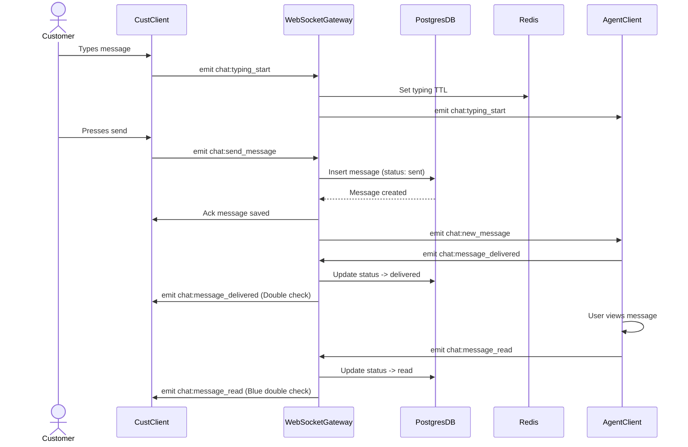
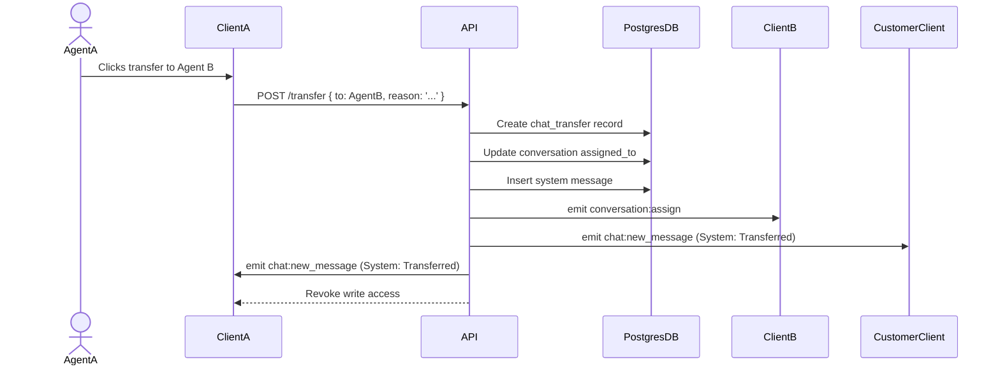
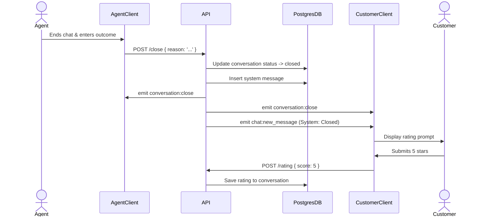
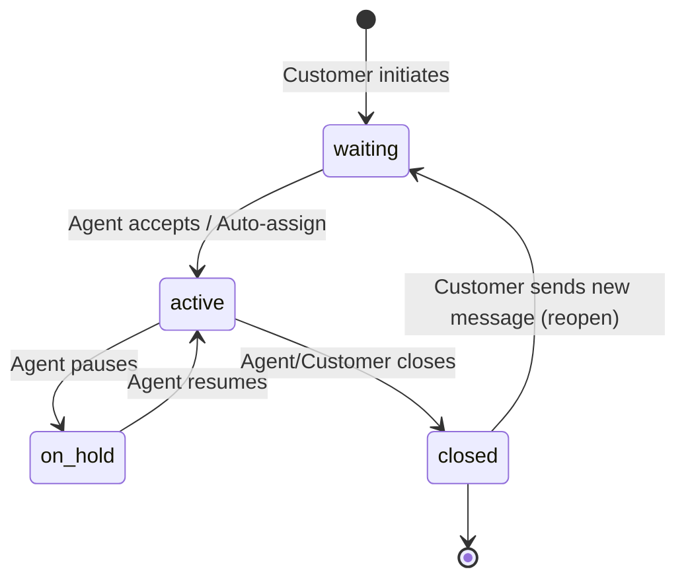
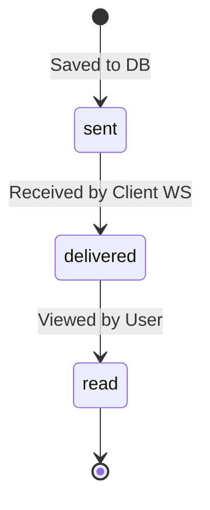

# Chat System Design: Prime One

## 1. Chat System Overview
The Chat System is the CORE module of Phase 1 for Prime One, a SaaS multi-tenant ISP CMS platform. It is designed to provide a real-time, bidirectional messaging experience between ISP customers and helpdesk agents, mirroring the user experience of popular applications like WhatsApp.

**Key Features:**
- **Real-time Bidirectional Messaging:** Instant communication between customers and staff.
- **Initiation:** Both customers and staff can initiate conversations.
- **Media Support:** Robust support for text, images, voice notes, videos, and documents.
- **Read Receipts:** Visual indicators for message status (sent ✓, delivered ✓✓, read ✓✓ blue).
- **Typing Indicators:** Real-time feedback when the other party is typing.
- **Presence:** Online/offline status indicators and last seen timestamps.
- **Chat History:** Persistent, infinitely scrollable history akin to WhatsApp.
- **Multi-tenancy:** Strict isolation of chats per company to ensure data privacy and security.

## 2. Technology Stack for Chat
- **WebSocket Gateway:** NestJS using Socket.io for robust, scalable WebSocket management.
- **Scaling:** Redis adapter for Socket.io to enable horizontal scaling across multiple instances.
- **Database:** PostgreSQL for persistent storage of messages, conversations, and metadata.
- **In-Memory Store:** Redis for managing real-time state like online presence, typing indicators, and session management.
- **Media Storage:** Cloudflare R2 for highly available, cost-effective storage of media files.
- **Push Notifications:** Firebase Cloud Messaging (FCM) for reliable push notifications when the application is in the background or offline.

## 3. WebSocket Connection Flow
The WebSocket connection process ensures secure, authenticated, and tenant-aware real-time communication.

1. **Client Connection Request:** The client initiates a WebSocket connection to the NestJS Gateway.
2. **Authentication Handshake:** The connection request includes a JWT in the `Authorization` header or query parameters.
3. **JWT Verification:** The server validates the JWT signature, expiration, and extracts user details (`user_id`, `role`, `company_id`).
4. **Tenant Context Extraction:** The `company_id` is extracted to ensure all subsequent actions are scoped to the correct tenant.
5. **Presence Update:** The user's status is marked as 'online' in Redis.
6. **Room Joining:**
   - User Room: `user_{user_id}` (for direct events like notifications).
   - Conversation Rooms: The server fetches active conversations for the user and joins them to `conversation_{conversation_id}` rooms.
   - Company Room (Agents only): `company_{company_id}_agents` for broadcast events like new unassigned chats.
7. **Reconnection Strategy & Missed Message Sync:**
   - On connection, the client sends the `last_message_id` it received.
   - The server queries PostgreSQL for any messages in the user's active conversations created after `last_message_id`.
   - Missed messages are synced to the client before standard real-time flow resumes.

## 4. Complete WebSocket Events Catalog

### Client → Server Events
| Event Name | Payload Schema | Behavior |
| :--- | :--- | :--- |
| `chat:send_message` | `{ conversation_id: UUID, type: 'text'\|'image'\|'voice'\|'video'\|'document', content: string, file_url?: string }` | Validates, persists, and broadcasts the message. |
| `chat:typing_start` | `{ conversation_id: UUID }` | Updates Redis TTL and broadcasts typing start. |
| `chat:typing_stop` | `{ conversation_id: UUID }` | Removes typing state and broadcasts stop. |
| `chat:message_delivered` | `{ message_ids: UUID[], conversation_id: UUID }` | Updates message status to 'delivered' in DB and broadcasts. |
| `chat:message_read` | `{ message_ids: UUID[], conversation_id: UUID }` | Updates message status to 'read' in DB and broadcasts. |
| `chat:messages_read_all` | `{ conversation_id: UUID }` | Marks all unread messages in the conversation as read. |

### Server → Client Events
| Event Name | Payload Schema | Behavior |
| :--- | :--- | :--- |
| `chat:new_message` | `{ message: MessageObject }` | Broadcasts new message to conversation room. |
| `chat:typing_start` | `{ conversation_id: UUID, user_id: UUID }` | Indicates a user has started typing. |
| `chat:typing_stop` | `{ conversation_id: UUID, user_id: UUID }` | Indicates a user has stopped typing. |
| `chat:message_delivered`| `{ message_ids: UUID[], conversation_id: UUID }` | Notifies sender that messages were delivered. |
| `chat:message_read` | `{ message_ids: UUID[], conversation_id: UUID }` | Notifies sender that messages were read. |
| `presence:online` | `{ user_id: UUID, last_seen: timestamp }` | Broadcasts user online status. |
| `presence:offline` | `{ user_id: UUID, last_seen: timestamp }` | Broadcasts user offline status. |
| `presence:status_update`| `{ user_id: UUID, status: string }` | Broadcasts custom status updates. |
| `conversation:create` | `{ conversation: ConversationObject }` | Notifies agents of a new waiting chat. |
| `conversation:assign` | `{ conversation_id: UUID, agent_id: UUID }` | Notifies room of assignment. |
| `conversation:transfer` | `{ conversation_id: UUID, from_agent: UUID, to_agent: UUID, reason: string }` | Notifies room of transfer. |
| `conversation:close` | `{ conversation_id: UUID, closed_by: UUID, reason: string }` | Notifies room of closure. |
| `conversation:reopen` | `{ conversation_id: UUID, reopened_by: UUID }` | Notifies room of reopening. |
| `conversation:update` | `{ conversation_id: UUID, updates: Object }` | Notifies of metadata updates. |
| `notification:new` | `{ title: string, body: string, data: Object }` | General in-app notification. |

## 5. Message Flow (Complete Lifecycle)

### A) Customer Sends Text Message
1. **Typing:** Customer types → `chat:typing_start` sent → Server broadcasts to agent.
2. **Send:** Customer presses send → `chat:send_message` payload sent via WebSocket.
3. **Process:** Server receives, validates (auth, tenant, conversation access), and persists to PostgreSQL with status `sent`.
4. **Route:** Server injects `company_id` and broadcasts `chat:new_message` to `conversation_{id}` room.
5. **Delivery (Online Agent):** Agent receives via WebSocket → Client sends `chat:message_delivered` → DB updated → Sender notified.
6. **Delivery (Offline Agent):** If agent offline (checked via Redis), server triggers FCM push notification.
7. **Read:** Agent focuses chat/scrolls to message → Client sends `chat:message_read` → DB updated → Sender notified (blue ticks).

### B) Customer Sends Media
1. **Selection:** Customer selects media; client compresses if necessary.
2. **Upload:** Client POSTs file to `/api/v1/files/upload`.
3. **Storage:** Backend validates (size, mime type), uploads to Cloudflare R2, generates thumbnail.
4. **Response:** Backend returns `file_url` and `thumbnail_url`.
5. **Send:** Client emits `chat:send_message` including the `file_url` and `type` (e.g., 'image').
6. **Flow Continues:** Same as text message from step 3.

### C) Staff Sends Message to Customer
The flow mirrors A and B, ensuring full bidirectionality and identical read receipt logic.

### D) System Messages
System messages represent state changes and are inserted by the backend with `sender_type = 'system'`.
Examples:
- "Chat assigned to Agent Ali"
- "Chat transferred to Agent Usman. Reason: Technical issue"
- "Chat closed. Outcome: Issue resolved"
These messages are broadcasted via `chat:new_message` but are rendered distinctively in the UI.

## 6. Chat Assignment Logic
When a customer initiates a new chat:
1. **Creation:** A new conversation record is created with `status = 'waiting'`.
2. **Notification:** Available agents in the tenant are notified via the `company_{id}_agents` room (`conversation:create` event).
3. **Assignment:**
   - **Manual:** An agent clicks 'Accept' (API call to assign).
   - **Auto-assign:** If enabled by company, the system automatically assigns the chat based on strategy.
4. **Activation:** Conversation status changes to `active`, `assigned_to = agent_id`. A system message is posted.

**Company Configuration Options:**
- Auto-assign: On/Off
- Max concurrent chats per agent
- Assignment Strategy: Round-robin, least-busy, or manual queue only.

## 7. Chat Transfer Flow
1. **Initiation:** Agent selects 'Transfer Chat' and chooses a target agent or department.
2. **Reason:** Agent provides a mandatory text reason.
3. **Record:** System creates a `chat_transfer` record linking the conversation, agents, and reason.
4. **System Message:** "Chat transferred from [Agent A] to [Agent B]. Reason: [Reason]" is posted to the chat.
5. **Notification:** Target agent receives a notification and is added to the conversation room.
6. **Access Change:** Previous agent's access is revoked (or set to read-only based on tenant RBAC).

## 8. Chat Closure Flow
1. **Action:** Agent or customer clicks 'End Chat'.
2. **Reasoning:** Agent must provide an outcome/closure reason; optional for customers.
3. **State Change:** Conversation status becomes `closed`.
4. **System Message:** "Chat closed by [User]. Outcome: [Reason]" is posted.
5. **Rating (Customer):** Customer is presented with a rating prompt (1-5 stars + optional feedback).
6. **Post-Closure:** Customers can view the history but must start a new conversation to send new messages.

## 9. Working Hours
- **Configuration:** Tenant admins define working hours per day in settings.
- **Outside Hours Logic:**
  - Customers can still send messages; they are queued.
  - An immediate auto-reply is sent (e.g., "We are currently offline. Working hours: Mon-Fri 9-5. We will reply when we return.").
  - Messages are delivered when agents come online and process the queue.

## 10. Chat History & Pagination
- **Storage:** All messages persist permanently in PostgreSQL.
- **Initial Load:** Opening a conversation fetches the latest 50 messages.
- **Infinite Scroll:** Scrolling up triggers a request for the next 50 messages using cursor-based pagination (based on message `created_at` or auto-incrementing ID).
- **Accessibility:** Old, closed conversations remain accessible in a read-only state, scrollable just like active ones.

## 11. Private & Public Notes
- **Private Notes:** Agents can add internal notes. Stored as messages with `is_internal_note = true`. These are broadcast only to agent clients, never to the customer.
- **Public Notes/Messages:** Standard messages visible to all participants.

## 12. Quick Replies
- **Configuration:** Tenant owners can define template messages mapped to shortcuts.
- **Usage:** Agents type `/` in the input field to trigger a dropdown of available quick replies.
- **Action:** Selecting a reply auto-fills the input box, allowing the agent to send immediately or edit further.

## 13. Read Receipts Implementation
State machine: `sent` → `delivered` → `read`.
1. **Sent:** Saved to DB.
2. **Delivered:** Recipient's WebSocket connects and receives the message. Client emits `chat:message_delivered`. Server updates DB and notifies sender.
3. **Read:** Recipient client detects message in viewport (Intersection Observer). Emits `chat:message_read`. Server updates DB and notifies sender.
4. **Batch Read:** Opening a chat view emits `chat:messages_read_all` to efficiently mark the backlog.

## 14. Typing Indicator Implementation
- **Start:** Client emits `chat:typing_start`.
- **State:** Server stores in Redis: `typing:{conversation_id}:{user_id}` with a 5-second TTL.
- **Broadcast:** Server emits `chat:typing_start` to other participants.
- **Stop:** Client debounces typing (e.g., 3s pause) and emits `chat:typing_stop`. Server removes Redis key and broadcasts stop.
- **Safety:** The Redis TTL ensures indicators don't get stuck if a client disconnects ungracefully.

## 15. Online/Offline Presence
- **Connect:** On WebSocket `connection`, set user online in Redis (`presence:{user_id}`). Broadcast `presence:online` to active contacts/rooms.
- **Disconnect:** On WebSocket `disconnect`, wait 30 seconds (grace period for network blips). If still disconnected, remove Redis key, update PostgreSQL `last_seen`, and broadcast `presence:offline`.

## 16. Push Notification Strategy
- **Condition:** Evaluated before delivering a message via WebSocket.
- **Offline Check:** If recipient is NOT online in Redis.
- **Action:** Dispatch FCM push notification.
- **Payload:** `{ title: Sender Name, body: Preview Text, data: { conversation_id } }`
- **Grouping:** Mobile clients handle grouping multiple notifications from the same `conversation_id`.

## 17. Search
- **Local:** Agents can search within an active conversation view.
- **Global:** Agents can search across all accessible conversations.
- **Backend Implementation:** PostgreSQL full-text search using `tsvector` columns on message content, or indexed `ILIKE` queries for simpler setups.

## 18. Security Considerations
- **Encryption:** All transit is via HTTPS and WSS (TLS).
- **Validation:** Strict payload validation using DTOs and decorators in NestJS.
- **File Security:** Validation of MIME types, file size limits, and randomized secure filenames on R2.
- **Tenant Isolation:** Every DB query must include `company_id`. Row-Level Security (RLS) in PostgreSQL is recommended.
- **Rate Limiting:** IP and User-based rate limiting on the `/api/v1/files/upload` endpoint and WebSocket message emission to prevent spam.

## 19. Mermaid Diagrams

### Sequence: Customer sends message to agent

### Sequence: Chat transfer flow

### Sequence: Chat closure + rating flow

### State: Conversation States

### State: Message States

