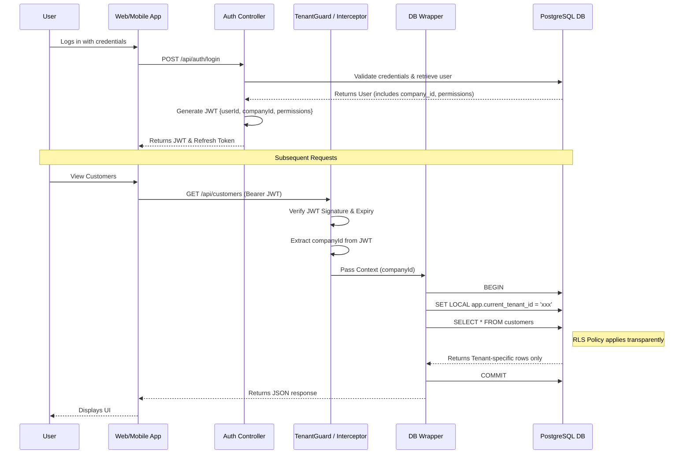

# Prime One Multi-Tenancy & Security Design

This document outlines the architectural patterns, security mechanisms, and multi-tenancy implementation for **Prime One**, a SaaS multi-tenant ISP CMS platform.

## 1. Multi-Tenancy Architecture

Prime One utilizes a **Single Database, Shared Schema** architecture where all tenants (companies) share the same PostgreSQL database and tables. Data isolation is maintained logically through a mandatory `company_id` column on all tenant-scoped tables.

### Why this approach was chosen
This approach was chosen over separate databases or separate schemas per tenant due to:
- **Simplicity of Maintenance:** Schema migrations apply once and instantly affect all tenants. There is no need to loop through thousands of schemas or databases to apply a patch.
- **Resource Efficiency:** A single connection pool and database instance are far more cost-effective and scale predictably, whereas separate databases incur massive memory and connection overhead.
- **Cross-Tenant Aggregation:** Platform owners can easily run aggregate queries (e.g., total active customers across all companies) without complex cross-database queries.

### Pros and Cons
**Pros:**
- Lowest infrastructure cost.
- Simple operational overhead.
- Fast onboarding of new tenants (no database provisioning required).
- Centralized backups and simplified disaster recovery.

**Cons:**
- Highest risk of cross-tenant data leakage if application code has a bug (mitigated via Row-Level Security).
- Noisy neighbor problems, where a heavy query by one tenant impacts overall database performance for others.
- Difficult to restore a single tenant's data to a point in time without affecting others.

### Data Isolation Layers
Data isolation is strictly enforced across three distinct layers:
1. **Application Layer:** Middleware extracts `company_id` from the verified JWT and automatically injects it into all ORM queries.
2. **Database Layer (Row-Level Security):** PostgreSQL RLS policies mathematically guarantee that a query can only return or modify rows where the `company_id` matches the current session context.
3. **API Access Control:** Endpoints explicitly validate that the requested resource belongs to the tenant identified in the token.

---

## 2. Security Layers (Defense in Depth)

Prime One employs a Defense in Depth strategy, applying security controls at every level of the stack.

### Layer 1: Network Level
- **Cloudflare Proxy:** All traffic flows through Cloudflare, hiding the true IP of the origin server to prevent direct network attacks.
- **SSL/TLS Encryption:** Strict HTTPS enforcement everywhere (HSTS). Data in transit is fully encrypted.
- **DDoS Protection:** Cloudflare automatically absorbs volumetric attacks, and Web Application Firewall (WAF) rules block known malicious signatures.

### Layer 2: Application Level
- **Rate Limiting:** IP-based and user-based rate limiting (e.g., 100 requests per minute per user) to prevent brute force and volumetric abuse.
- **CORS Configuration:** Strict Cross-Origin Resource Sharing rules allowing only explicit frontend domains.
- **Security Headers:** Implementation of Helmet.js to enforce strict CSP, prevent clickjacking (X-Frame-Options), and disable MIME sniffing.
- **Input Validation:** Zod/Class-Validator schemas on all endpoints ensure strict typing and sanitization of incoming payloads.
- **File Upload Validation:** Verification of file extensions, MIME types, magic bytes, and strict file size limits before processing uploads.

### Layer 3: Authentication
- **JWT Access Tokens:** Short-lived tokens (15 minutes) signed with RS256/HS256.
- **Refresh Tokens:** Long-lived tokens (7 days), stored as bcrypt hashes in the database. Can be revoked immediately.
- **MFA / OTP:** Email OTP verification for critical actions or secondary authentication.
- **Password Hashing:** Passwords securely hashed using bcrypt with a work factor of 12 rounds.
- **Account Lockout:** Automatic temporary lockout (e.g., 15 minutes) after 5 consecutive failed login attempts.
- **Login History:** Comprehensive tracking of all login attempts (success and failure) with IP address and User-Agent.

### Layer 4: Authorization (RBAC)
- **Permission-Based Control:** Access is strictly driven by fine-grained permissions, not monolithic roles.
- **Custom Permission Groups:** Company owners can create custom groups (e.g., "Level 1 Support") and attach specific permissions.
- **User-Level Overrides:** Ability to explicitly grant or deny specific permissions to a user, overriding group settings.
- **`@PermissionGuard`:** A custom decorator applied to endpoints that intercepts the request and verifies the user holds the required permission.
- **Tenant Context Restriction:** Company Owners and Staff are fundamentally restricted to viewing and managing resources only within their assigned `company_id`.

### Layer 5: Tenant Isolation (Database)
We use PostgreSQL Row-Level Security (RLS) to enforce isolation at the lowest level. This guarantees that even if a developer forgets to include `where company_id = ?` in the ORM, the database will silently filter out cross-tenant data.

**Setting RLS Policies:**
```sql
-- Enable RLS on the table
ALTER TABLE customers ENABLE ROW LEVEL SECURITY;

-- Create policy for isolation
CREATE POLICY tenant_isolation_policy ON customers
    FOR ALL
    USING (company_id = current_setting('app.current_tenant_id')::uuid);
```

**Setting the Session Variable:**
Upon establishing a connection from the pool, the backend runs:
```sql
SET LOCAL app.current_tenant_id = 'a1b2c3d4-e5f6-7890-1234-56789abcdef0';
```

**Application Enforcement:**
- **Drizzle ORM Tenant Wrapper:** A customized database wrapper ensures the `SET LOCAL` command is executed before the main transaction/query block.
- **TenantGuard Middleware:** Extracts the `companyId` from the JWT and injects it into the request context for the ORM wrapper to consume.

### Layer 6: API Security for External Integrations
- **API Keys & Secrets:** External integrations use a unique, cryptographically secure API Key and Secret per company.
- **HMAC Signatures:** Webhook payloads are signed using the API Secret. Receivers must verify the HMAC-SHA256 signature to guarantee authenticity.
- **IP Whitelisting:** Optional configuration to restrict API Key usage to specific inbound IP addresses.

### Layer 7: Audit & Compliance
- **Audit Trails:** All sensitive data modifications (create, update, delete) are logged in an immutable audit table.
- **Change History:** Audit logs store the exact `old_values` and `new_values` as JSONB.
- **Context Logging:** Every log entry includes the timestamp, `user_id`, `company_id`, IP address, and User-Agent.
- **Data Retention Policies:** Automated archival or deletion of data according to configurable retention rules, aiding GDPR compliance.

---

## 3. Tenant Resolution Flow

The following sequence diagram illustrates the lifecycle of tenant resolution from authentication to database query.



---

## 4. RBAC Permission System Design

The Role-Based Access Control (RBAC) system is completely granular, utilizing a hybrid of module and action-level definitions. There are no hard-coded roles like "Admin" or "Agent"; instead, everything relies on permission evaluation.

### Permission Structure
Permissions are structured as `module.action`.

```text
Permission Category (Module Level)
└── Permission (Action Level)
    ├── chat.view
    ├── chat.send
    ├── chat.transfer
    ├── chat.close
    ├── chat.delete
    ├── chat.view_internal_notes
    └── chat.manage_quick_replies
```

### Default Permission Categories & Permissions

**Chat Module**
- `chat.view`: View chat conversations.
- `chat.send`: Send messages in chats.
- `chat.transfer`: Transfer chats to other agents or departments.
- `chat.close`: Resolve or close chats.
- `chat.delete`: Permanently delete chat records.
- `chat.view_internal_notes`: Read internal staff notes on a chat.
- `chat.add_internal_note`: Add internal staff notes on a chat.
- `chat.manage_quick_replies`: Create or edit canned responses.
- `chat.view_all_conversations`: View chats not assigned to the user.
- `chat.assign`: Assign chats to specific agents.

**Customer Module**
- `customer.view`: View customer records.
- `customer.create`: Add new customers.
- `customer.edit`: Modify existing customer data.
- `customer.delete`: Remove a customer record.
- `customer.view_360`: View the complete 360-degree customer profile (billing, tickets, usage).
- `customer.export`: Export customer lists to CSV/Excel.

**User Management Module**
- `user.view`: View staff accounts.
- `user.create`: Invite or create new staff accounts.
- `user.edit`: Modify staff details.
- `user.delete`: Deactivate or delete staff accounts.
- `user.manage_permissions`: Assign groups or user-level overrides.

**Branch Module**
- `branch.view`: View branch locations.
- `branch.create`: Add a new branch.
- `branch.edit`: Modify branch details.
- `branch.delete`: Delete a branch.

**Reports Module**
- `reports.view_chat_reports`: Access chat metrics and analytics.
- `reports.view_agent_performance`: Access agent efficiency and workload data.
- `reports.export`: Download reports.

**Settings Module**
- `settings.company_profile`: Modify general company info.
- `settings.branding`: Update logos and colors.
- `settings.working_hours`: Configure SLA and working hours.
- `settings.notifications`: Set up webhooks and email alerts.

**Audit Module**
- `audit.view_logs`: View the system audit trail.
- `audit.export_logs`: Download audit data.

### Permission Checking Flow

```text
Request arrives
→ AuthGuard: Is JWT valid?
→ TenantGuard: Is tenant active?
→ PermissionGuard(@RequirePermission('chat.transfer')):
    1. Retrieve user's permission groups from token/DB cache
    2. Aggregate all permissions from all groups the user belongs to
    3. Apply user-level overrides (both grants and denials)
    4. Check if 'chat.transfer' is present in the final granted list
    → YES: proceed to Controller
    → NO: 403 Forbidden
```

### Permission Resolution Logic
- **Group Aggregation:** A user can belong to multiple permission groups. A permission granted in ANY of the user's groups results in a cumulative grant.
- **Explicit Overrides:** A user-level override ALWAYS wins.
  - If group grants `chat.delete`, but user override explicitly DENIES `chat.delete`, the result is **Denied**.
  - If group denies (or omits) `reports.export`, but user override explicitly GRANTS `reports.export`, the result is **Granted**.

---

## 5. Company Branding & Customization

The platform allows white-labeling via the `companies` table.

- **Data Stored:** `logo_url`, `favicon_url`, `primary_color`, `secondary_color`.
- **Web Portal:** Upon successful login, the frontend fetches the `/api/company/branding` endpoint. CSS variables are injected dynamically, and the logo is swapped in the navbar.
- **Generic Customer App (Flutter):** The app shell is generic on the app store. Once a customer logs in, the app queries the backend, retrieves the ISP's branding context, and dynamically restyles the interface, presenting a fully customized experience for that specific ISP.

---

## 6. Platform Owner vs Company Owner Permissions Matrix

| Action | Platform Owner | Company Owner | Company Staff |
|--------|---------------|---------------|---------------|
| Create New Company | ✅ | ❌ | ❌ |
| View All Companies | ✅ | ❌ | ❌ |
| Suspend Company Account | ✅ | ❌ | ❌ |
| Modify Global System Settings | ✅ | ❌ | ❌ |
| Manage Billing & Subscriptions | ✅ | ✅ (Own company only) | ❌ |
| Update Company Branding | ❌ (Delegated) | ✅ | ❌ (Unless permitted) |
| Manage Staff Accounts | ❌ (Delegated) | ✅ | ❌ (Unless permitted) |
| Create Permission Groups | ❌ | ✅ | ❌ (Unless permitted) |
| Access Customer Data | ❌ (Privacy) | ✅ | ✅ (Based on permissions) |
| View Audit Logs | ✅ (System-wide) | ✅ (Company-wide) | ❌ (Unless permitted) |

---

## 7. Security Best Practices Checklist

- [x] **SQL Injection Prevention:** Strict use of parameterized queries and the Drizzle ORM. No raw string concatenation in SQL execution.
- [x] **XSS Prevention:** Input sanitization and React/Flutter's native DOM escaping mechanisms.
- [x] **CSRF Protection:** Anti-CSRF tokens for session-based flows; primarily mitigated by using JWTs in Authorization headers instead of cookies.
- [x] **Secure Cookies:** Any fallback cookies are marked `HttpOnly`, `Secure`, and `SameSite=Strict`.
- [x] **Environment Variables:** All secrets managed via environment variables and injected at runtime.
- [x] **Secret Rotation:** API Keys and JWT secrets have automated or zero-downtime manual rotation strategies.
- [x] **Data Encryption at Rest:** Database volume level encryption (e.g., AWS EBS encryption or equivalent).
- [x] **GDPR Considerations:** Implementation of Right to be Forgotten (soft/hard deletes), explicit consent tracking, and PII data masking in logs.

---

## 8. Threat Model

| Threat | Description | Mitigation Strategy |
|--------|-------------|---------------------|
| **Cross-Tenant Data Leakage** | A bug in the application logic accidentally exposes Tenant A's data to Tenant B. | PostgreSQL Row-Level Security (RLS) ensures that the database intrinsically filters records. |
| **Token Theft / Replay** | An attacker steals a JWT and uses it to impersonate a user. | Short token expiration (15m), strict HTTPS enforcement, IP mismatch detection, and ability to forcibly revoke refresh tokens. |
| **Privilege Escalation** | A staff member manipulates API requests to perform Admin actions. | Server-side validation of all permissions via `@PermissionGuard` and absolute rejection of client-side role assertions. |
| **Brute Force Attacks** | Attacker repeatedly guesses passwords or OTPs. | Rate limiting per IP/user, account lockouts after 5 failed attempts, and implementation of CAPTCHA on login endpoints if anomalies are detected. |
| **File Upload Attacks** | Uploading malicious scripts (e.g., PHP, JS) posing as images. | Validation of magic bytes, enforcement of strict MIME types, uploading to isolated S3 buckets, and serving via CDN without execution permissions. |
| **WebSocket Abuse** | Spamming real-time chat endpoints or listening to unauthorized channels. | Authentication payload required during WebSocket handshake. Server validates channel subscriptions against the user's `company_id` and permissions. |
