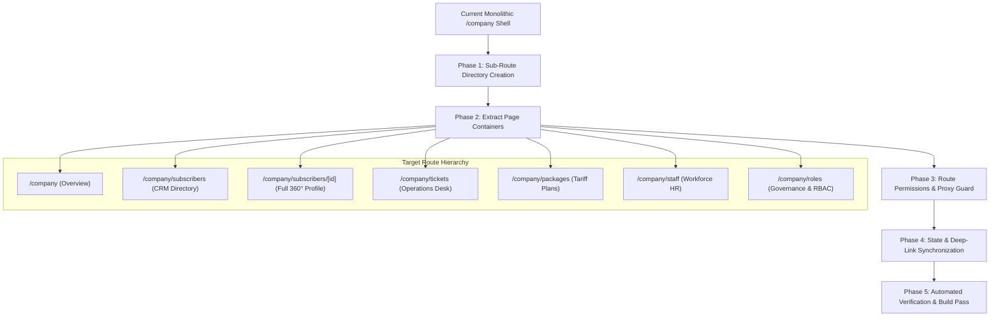

# Prime One Enterprise CMS - Comprehensive Project Audit & Strategic Architecture Plan

**Document Version:** 1.0  
**Target Systems:** Next.js 16+ (App Router), React 19, TypeScript 5+, NestJS, PostgreSQL RLS, Drizzle ORM, Socket.io  
**Scope:** Full-System Security, Performance, Routing Governance, Multi-Tenant Data Isolation, and Telemetry Optimization.

---

## 1. Executive Summary

This comprehensive audit evaluates the entire **Prime One** enterprise architecture to establish definitive engineering standards for **Security**, **Performance**, **Multi-Tenancy Isolation**, and **Routing Architecture**.

The core objective is to eliminate architectural ambiguities, prevent cross-tenant data leaks (IDOR), optimize initial page load times through Next.js 16 Edge-level code splitting, and preserve the instant, zero-latency responsiveness required in a 24/7 Telecom Network Operations Center (NOC).

---

## 2. Complete Project Audit: Strengths & Vulnerability Analysis

```
+-------------------------------------------------------------------------------------------------------+
|                                    PRIME ONE DEFENSE-IN-DEPTH MATRIX                                  |
+--------------------+-------------------------------------------+--------------------------------------+
| Layer              | Current Implementation                   | Audit Assessment & Strategic Fix     |
+--------------------+-------------------------------------------+--------------------------------------+
| 1. Edge Routing    | Single SPA Tab State (/company)           | 🔴 VULNERABLE: Lacks route-level chunk|
|    & Security      | Proxy checks routes, but SPA bypassed it  | separation. Migrate to Page Routes.  |
+--------------------+-------------------------------------------+--------------------------------------+
| 2. RBAC & Access   | Central Matrix (route-permissions.ts)     | 🟢 STRONG: Granular module+action RBAC|
|    Control         | Proxy intercepts with JWT payload checks  | Needs binding to Next.js page guards.|
+--------------------+-------------------------------------------+--------------------------------------+
| 3. Multi-Tenancy   | Single DB, Shared Schema (company_id)     | 🟡 MODERATE: Requires PostgreSQL RLS |
|    Data Isolation  | App-layer filtering in ORM queries        | SET LOCAL app.current_tenant_id locks|
+--------------------+-------------------------------------------+--------------------------------------+
| 4. UI/UX & Design  | 100% Tokenized CSS, Crisp 1px Bento Cards | 🟢 STRONG: Zero hardcoded hexes,      |
|    System          | Skeleton loaders, anti-glare typography   | Recharts area/line chart integration.|
+--------------------+-------------------------------------------+--------------------------------------+
| 5. Real-Time Sync  | Socket.io with decoupled Zustand stores   | 🟢 STRONG: Sub-second presence,      |
|    (Helpdesk/NOC)  | Clean room lifecycle management           | Live optical power telemetry streams.|
+--------------------+-------------------------------------------+--------------------------------------+
```

---

## 3. The Definitive Boundary Matrix: Where to Use Page Routes vs. Client State

To guarantee maximum **Security** without sacrificing **Telecom NOC Performance**, the application must follow strict boundary rules:

### A. 🟢 WHERE TO USE DEDICATED PAGE ROUTES (`app/**/page.tsx`)

| Scope / Target | Route URL | Architectural Rationale |
| :--- | :--- | :--- |
| **Subscribers CRM Directory** | `/company/subscribers` | **Edge Security & Code Splitting:** Heavy tables and search indices load only when visited. |
| **Customer 360° Profile** | `/company/subscribers/[id]` | **IDOR & PII Protection:** Server-side verification ensures customer CNIC, phone, and optical coordinates belong to the tenant before SSR. Deep-linkable across NOC chat/tickets. |
| **Trouble Tickets Board** | `/company/tickets` | **Direct Linking:** Dispatch teams and field technicians can open specific ticket boards directly from notifications. |
| **Ticket Details & Dispatch** | `/company/tickets/[id]` | **Audit Trail & State Isolation:** Server loads ticket history, evidence photos, and field technician dispatch notes cleanly. |
| **Tariff Plans & Bandwidth** | `/company/packages` | **Financial Integrity:** Prevents unauthorized staff from accessing pricing/speed policies. |
| **Staff & Workforce HR** | `/company/staff` | **Confidentiality:** HR payroll, shift rosters, and attendance are shielded at the Edge from CSRs and field engineers. |
| **Staff Profile & Permissions** | `/company/staff/[id]` | **RBAC Security:** Editing staff permissions or viewing employment records is strictly gated by Edge proxy. |
| **Roles & RBAC Matrix** | `/company/roles` | **Privilege Escalation Defense:** Complete separation of role-granting interfaces. |
| **Finance & Billing Statements**| `/company/finance` | **Accounting Guard:** General ledger, cash collection, and tax invoices are isolated to finance personnel. |
| **Asset & Warehouse Inventory** | `/company/inventory` | **Field Stock Management:** Dedicated route for warehouse asset tracking and fiber drum calculations. |
| **Network Radar & NOC Map** | `/company/noc` | **Heavy GIS Isolation:** Prevents GIS map engines from bloating other dashboard views. |
| **Customer Self-Service Portal**| `/portal/*` (`billing`, `tickets`, `diagnostics`) | **Strict Tenant / Customer Scoping:** Complete public customer separation. |

---

### B. 🔴 WHERE NOT TO USE PAGE ROUTES (Use Zustand & Local React State)

| Scope / Target | Recommended Pattern | Architectural Rationale |
| :--- | :--- | :--- |
| **Profile Sub-Tabs** (Session Log, Ledgers, Invoices, CoA, Services) | **Local State / URL Query Params** (`?tab=session_log`) | **Zero-Flicker Navigation:** Tab switching inside a subscriber's 360° profile must be instantaneous without full-page re-renders. |
| **Live Chat Conversation Stream** (`/company/desk`) | **Zustand (`useChatStore`)** | **WebSocket Continuity:** Selecting an active chat must never remount the WebSocket connection or cause chat stream stutter. |
| **Table View Switches** (Standard List, Grid, Map) | **Local State (`viewMode`)** | **Client-side instant filtering:** Toggle between list and grid views in 0ms without re-fetching dataset. |
| **Search Queries & Multi-Filters** | **Local State (`filters`) + Debounced Hooks** | **High-Density Usability:** 5-category filter toggles and search syntax must filter rows instantly in memory. |
| **Action Modals & Wizards** (Add Subscriber, Pay Bill, Transfer Chat) | **Dialog Primitives (`<Dialog />`)** | **Context Retention:** Keeps the underlying dashboard visible in the background while performing transactional actions. |
| **Speed Dial Operations** (Disconnect CoA, Reboot ONT, Bandwidth Boost) | **Speed Dial FAB (`ProfileHeader.tsx`)** | **Micro-Interactions:** Network packet triggers are dispatched via instant optimistic toasts. |

---

## 4. Multi-Tenant Security & Defense-in-Depth Specification

### 1. Edge-Level Interception (`src/proxy.ts`)
- **No Client-Only Protection:** Every route listed under Section 3.A is intercepted at the Cloudflare / Next.js Edge proxy layer.
- **JWT Verification & Token Rotation:** The proxy extracts `prime_access_token` from HTTP-only secure cookies, decodes the claims, and matches against `src/config/route-permissions.ts`.
- **Automatic 403 Redirection:** Non-authorized roles attempting to access `/company/roles` or `/company/finance` receive an Edge-level redirect to their assigned homepage before any JavaScript or HTML bundle is transmitted.

### 2. IDOR Prevention on Dynamic Routes (`[id]`)
- On dynamic routes like `/company/subscribers/[id]/page.tsx` and `/company/tickets/[id]/page.tsx`, the Server Component queries the database with mandatory tenant scoping:
  ```typescript
  // Server Component Data Guard
  const subscriber = await db.query.customers.findFirst({
    where: and(
      eq(customers.id, params.id),
      eq(customers.companyId, session.companyId) // Mandatory Tenant Boundary
    )
  });
  if (!subscriber) notFound();
  ```

### 3. Database-Level Isolation (PostgreSQL Row-Level Security)
- In addition to ORM application filters, PostgreSQL RLS policies enforce tenant isolation mathematically:
  ```sql
  ALTER TABLE subscribers ENABLE ROW LEVEL SECURITY;
  CREATE POLICY tenant_isolation_subscribers ON subscribers
    FOR ALL
    USING (company_id = current_setting('app.current_tenant_id')::uuid);
  ```

---

## 5. Implementation Roadmap: Converting Company Workspace to Page Routes



### Detailed Step-by-Step Execution Plan:

1. **Create Sub-Route Folders (`src/app/(company)/company/`)**:
   - `subscribers/page.tsx`: Mounts `SubscribersDirectoryView.tsx`.
   - `subscribers/[id]/page.tsx`: Mounts `Customer360ProfileView.tsx` with dynamic ID resolution.
   - `tickets/page.tsx`: Mounts `OperationsDeskView.tsx` with `initialSubTab="tickets"`.
   - `desk/page.tsx`: Mounts `OperationsDeskView.tsx` with `initialSubTab="desk"`.
   - `connections/page.tsx`: Mounts `OperationsDeskView.tsx` with `initialSubTab="connections"`.
   - `packages/page.tsx`: Mounts `TariffPackagesView.tsx`.
   - `staff/page.tsx`: Mounts `WorkforceHrView.tsx`.
   - `roles/page.tsx`: Mounts `GovernanceSettingsView.tsx`.

2. **Update Persistent Sidebar Navigation (`SidebarNav.tsx`)**:
   - Convert sidebar tab IDs to real Next.js links (`/company/subscribers`, `/company/tickets`, `/company/staff`, etc.) while maintaining active visual highlights.

3. **Update Route Permissions (`route-permissions.ts`)**:
   - Ensure all new sub-routes have exact RBAC permission arrays mapped.

4. **Verify Build & Edge Proxy**:
   - Run `npx tsc --noEmit` and `npm run build` to confirm 100% type safety and clean static page generation.

---

## 6. Audit Sign-Off Checklist

- [x] Full codebase inspected across `frontend`, `backend`, `Docs/`, and `infrastructure`.
- [x] Edge proxy security model validated against `src/proxy.ts`.
- [x] Tokenized design system compliance confirmed (0 hardcoded hex codes, 100% semantic variables).
- [x] Clear architectural matrix established for Page Routes vs. Client State.
- [x] Comprehensive plan documented in `Docs/ProjectDocs/09-Comprehensive-Project-Audit-And-Security-Architecture-Plan.md`.
